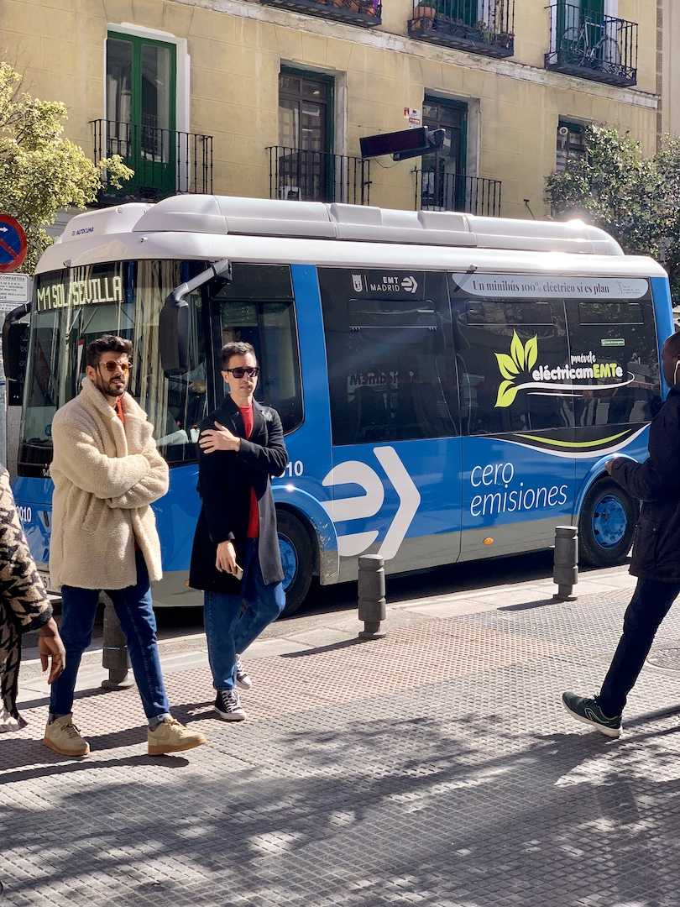
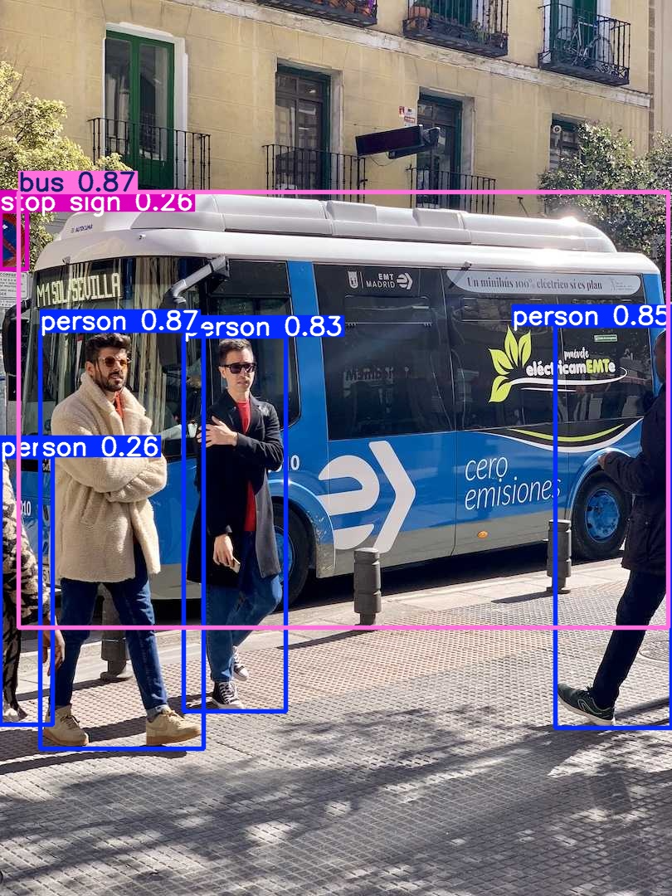

# IIIT AIML Online Internship

## Week 2 Tasks (1,2,3)

### Task 1 – Create Python Virtual Environment

A Python virtual environment was created using the following command:

python -m venv myenv

The environment was activated before installing packages.

---

### Task 2 – Install Ultralytics

The Ultralytics package was installed using the command:

pip install ultralytics

This installs YOLOv8 along with dependencies such as torch, torchvision and opencv.

---

### Task 3 – Object Detection using YOLOv8

The YOLOv8 pretrained model was used to detect objects in an image.

### Input Image

### Output Detection

Detected objects include:
- Person
- Bus
- Stop Sign
